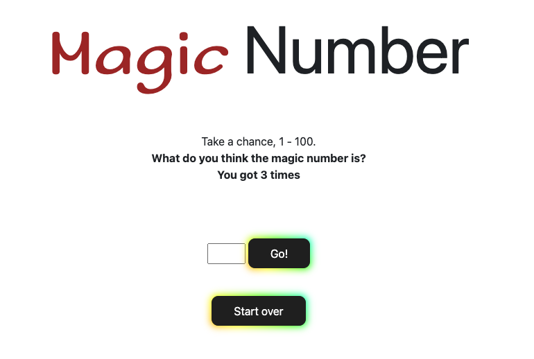

# Magic Number Game 🎈

A simple guessing game built with HTML, JavaScript, and Bootstrap. In this game, the player has three attempts to guess a randomly generated magic number between 1 and 100. Correct guesses trigger a celebratory balloon animation, while failed attempts are met with a "Game Over" message.

## Features

- **Random Number Generation**: Each game round generates a random number between 1 and 100.
- **Attempt Limiting**: Players get exactly 3 attempts to guess the correct number.
- **Feedback Messages**: Informative messages guide the player if the guess is too high or too low.
- **Victory Animation**: Correct guesses release colorful floating balloons.
- **Game Reset Option**: Allows players to reset the game and try again.

## Preview



## Installation

Clone or download this repository to your local machine:
```bash
git clone https://github.com/AJun01/magic-number.git